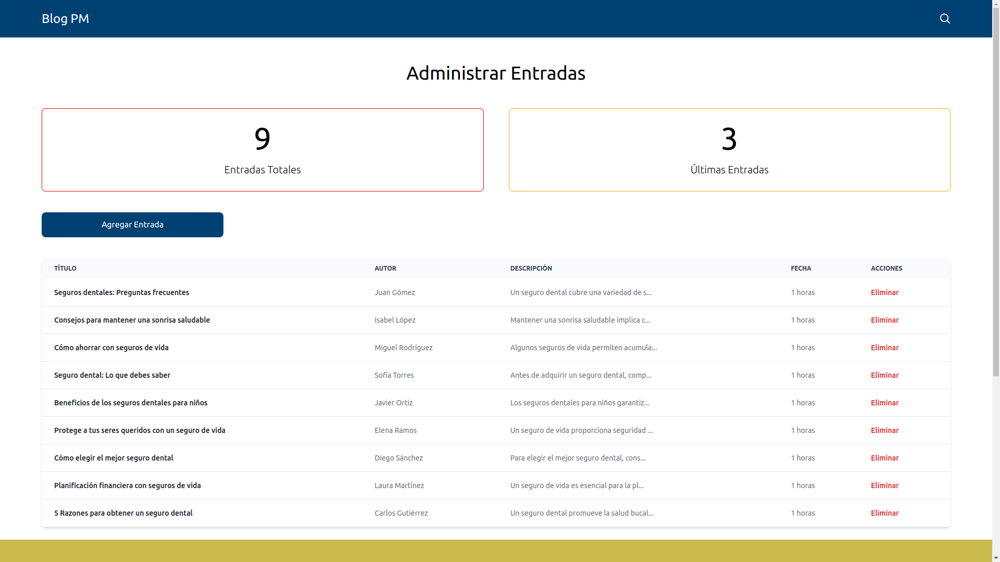
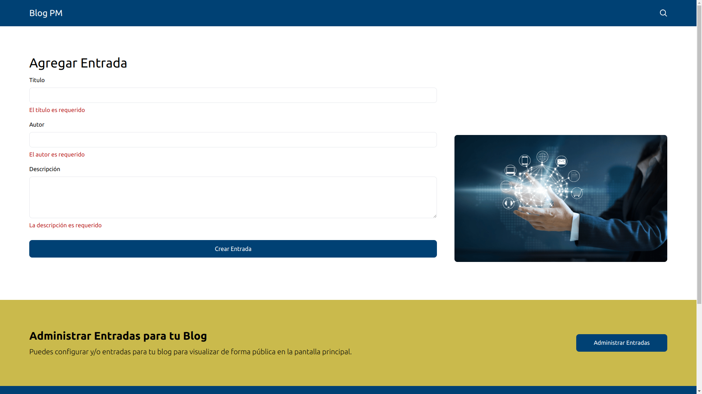

# Blog

El siguiente repositorio cuenta con 2 carpetas principales:
- [Blog](#blog)
  - [Capturas de pantalla](#capturas-de-pantalla)
  - [Backend](#backend)
  - [Frontend](#frontend)


## Capturas de pantalla
Cuenta con una pantalla principal

Lista de Entradas

Las entradas permiten administrarse

Permite agregar entradasm con los campos obligatorios, exceptuando la imagen.
- Título
- Autor
- Contenido
- Imagen
  

Visualizamos una entrada a detalle

En la parte superior permite realizar búsqueda de entradas
- Título
- Autor
- Contenido
  

## Backend
1. Clona el repositorio
2. Accede a la carpeta blog-backend
```bash
 cd blog-backend/
```
3. Crea el archivo `.env` en base a `.env.example`.
  ```bash
 PORT=PUERTO_DESPLEGAR
DATABASE_NAME=NOMBRE_BASE_DE_DATOS
DATABASE_USER=NOMBRE_USUARIO
DATABASE_PASSWORD=CONTRASEÑA_BASE_DE_DATOS
DATABASE_PORT=PUERTO_ALOJADO_BASE_DE_DATOS
HOSTNAME=HOST
CLOUDINARY_URL=KEY_CLOUDINARY
```
4. Asegúrate de tener Node.js instalado (versión >= 18.18.2).
5. Es necesario contar con MySQL instalado
```bash
 # Crear Base de datos
 create database blogPM;
 use blogPM;
 
 # Crear Tabla
    create table posts(
    id int PRIMARY KEY auto_increment not null,
    title varchar(100) not null,
    description varchar(600) not null,
    image varchar(100) ,
    author varchar(100) not null,
    isActive boolean default 1
    );
    alter table posts add createdAt timestamp DEFAULT CURRENT_TIMESTAMP ON UPDATE CURRENT_TIMESTAMP;
    alter table posts add updatedAt timestamp DEFAULT CURRENT_TIMESTAMP ON UPDATE CURRENT_TIMESTAMP;
```
6. Ejecuta los siguientes comandos para su ejecución:
```bash
# Instalar Dependencias
npm install
# Inciar Servidor
npm run dev
```


## Frontend
1. Accede a la carpeta blog-frontend
```bash
 cd blog-frontend/
```
2. Crea el archivo `.env` en base a `.env.example`.
  ```bash
  VITE_URL_BACKEND=URL_SERVER_BACKEND
  ```
2. El VITE_URL_BACKEND lo obtienes al ejecutar blog-backend.
3. Ejecuta los siguientes comandos para su ejecución:
```bash
# Instalar Dependencias
npm install
# Inciar Servidor
npm run dev
```
